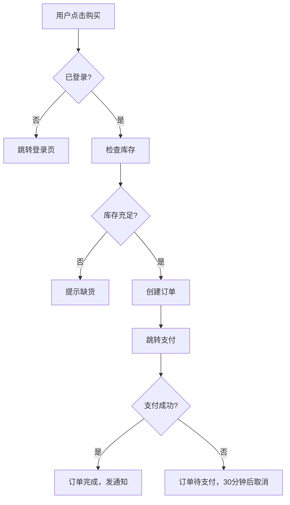

# AI 辅助开发框架

> 这套框架**怎么用**。要**装**它，跑 `/init-project`——CLAUDE.md 规则、hook、docs 骨架
> 会直接写进项目，不用照着文档抄。抄到第三步就烦了，新项目粗糙就是这么来的。

**一句话总结**：流程图是"做什么"，CLAUDE.md 是"怎么做"，design 是"做成什么样"，skill 是"AI 用什么姿势做"。

心智模型的来龙去脉见 [ai-dev-mental-model.md](./ai-dev-mental-model.md)。

---

## 装完之后长什么样

```
my-project/
├── CLAUDE.md              # 指挥中心，AI 每次对话第一个读
├── .claude/
│   ├── settings.json      # hook 配置（可提交进 git）
│   ├── hooks/             # 行数检查 + 结构体检
│   └── skills/            # AI 技能
├── docs/
│   ├── decisions.md       # 决策与踩坑 —— 项目记忆，跟代码一起走
│   ├── flows/             # Mermaid 流程图
│   ├── design/            # 设计规范（有 UI 才建）
│   └── reference/         # 知识库（按需长出来）
├── src/
└── tests/
```

`docs/` 下面**不预建空目录**。空目录看起来像已经组织好了，比没有更糟。

---

## 四件套各自放什么

### flows/ — 流程图

**不要贴图片。** 用 Mermaid 写在 markdown 里，AI 能精确读懂每个分支；读图片只能靠猜。

一个 `docs/flows/order-flow.md` 的样子：

````markdown
# 用户下单流程



## 关键规则

- 库存检查必须在创建订单之前，不能先创建再检查
- 待支付订单 30 分钟超时自动取消
- 支付成功后必须同时：扣库存 + 发通知，缺一不可

## 排查指南

| 症状 | 可能原因 | 检查位置 |
|------|---------|---------|
| 点击购买无反应 | 登录状态判断失败 | 节点 B 的逻辑 |
| 库存充足但提示缺货 | 库存查询缓存未更新 | 节点 D → E |
````

**图 + 关键规则 + 排查指南**，三样齐了 AI 才知道该做什么、不能漏什么、出问题去哪找。
只有图，它照着画的分支走，但不知道"库存检查必须在创建订单之前"这种约束。

### design/ — 设计规范（有 UI 才建）

| 文件 | 内容 |
|------|------|
| `tokens.md` | CSS 变量：颜色、间距、圆角、字号、动效时长、缓动、z-index |
| `themes.md` | 深色/浅色变量、组件库覆盖规则、状态语义色 |
| `ui-patterns.md` | 常见 UI 模式的 do / don't，新组件检查清单 |

**变量优先，禁止硬编码。`tokens.md` 里没写的 = 不存在，AI 必须查完再用。**

### reference/ — 知识库（按需长出来）

| 文件夹 | 内容 |
|--------|------|
| `architecture/` | 技术栈、目录结构、分层图、模块依赖 |
| `api/` | 关键模块的接口签名和用法 |
| `patterns/` | 项目里反复使用的设计模式 |
| `guides/` | 复杂操作的分步指南 |
| `troubleshooting/` | 踩过的坑：现象 → 根因 → 解决 → 关联文件 |

不用一次写完。修 bug 写一条排查记录，遇到复杂操作写一份指南，慢慢积累。

> **flows/ 和 guides/ 的区别**：`flows/` 是"系统怎么运转"（运行时视角，Mermaid 为主），
> `guides/` 是"人该怎么一步步操作"（开发者视角，步骤清单为主）。

### decisions.md — 项目记忆

决策和踩坑写这里，**不要写进本机的记忆目录**——换台机器就丢了，协作者 clone 也看不到。
项目的事跟着项目走。

只写验证过的。猜测、纯咨询和原始对话不写进来。

---

## 日常工作流

### 新功能开发

```
1. 画流程图      docs/flows/ 下新建 md，Mermaid 画出来
2. 读上下文      reference/architecture/ 看全局，reference/patterns/ 找可复用的
3. 出方案        /plan-before-code，或直接让 AI 读流程图设计方案
4. 你审方案      对照流程图确认没跑偏，再动手
5. 写代码        按方案实现
6. 验证          /code-review + 自己对照流程图核关键分支
```

### 改 Bug

```
1. 定位流程      这个 bug 在哪个流程里？
2. 找偏差        流程图说这里该检查库存，代码跳过了
3. 修            按流程图的逻辑修
4. 验证          确认行为与流程图一致
5. 沉淀          非显而易见的坑 → 写进 reference/troubleshooting/
                 涉及取舍的决定 → 写进 decisions.md
```

### 改造既有项目

跑 `/init-project`。它会先勘察再分流，只补缺的，不覆盖你已经确认的方案。
重复跑进入审计模式，不会重复创建。

装完之后要人做的只有两件：把脑子里"不成文的规定"写进 `design/`，
把现有业务流程梳理成 Mermaid 图（可以让 AI 读 `src/` 帮你梳理初稿）。

---

## 为什么规则要靠 hook 而不是靠写

`docs/` 里的规范是软约束——AI 会读，但也会忘、会权衡掉。
可机械判定的规则（单文件行数、目录堆积、skill 双目录漂移）必须有会报错的东西兜底，
否则写多少遍都会慢慢失效。

需要上下文判断的原则（最小改动、避免过度设计、合理选型）则相反，
写死成检查清单只会让 AI 变成逐条打勾的实习生。这类留在 CLAUDE.md 和 skill 里当方向。

**能机械判定的交给 hook，需要判断的交给方向。**
分错了，前者会失效，后者会僵化。
