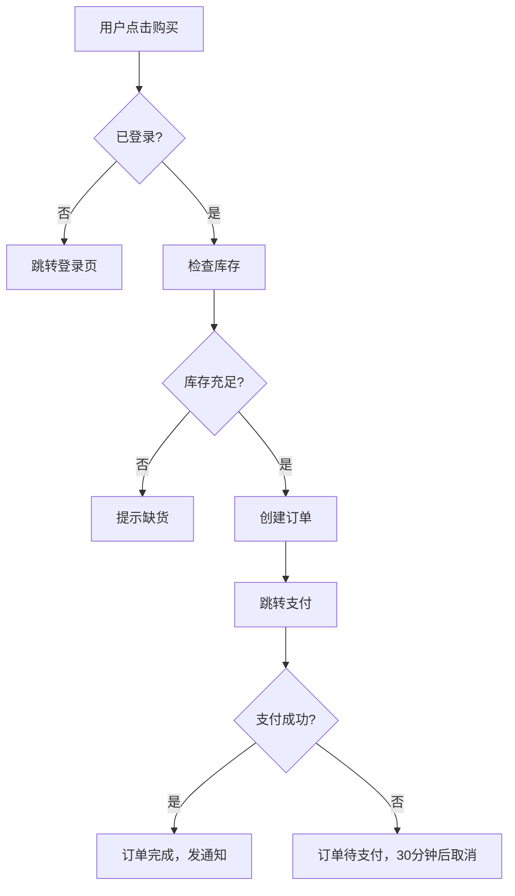

# AI 辅助开发框架模板

> 可直接复用的项目骨架。新建项目时照搬，现有项目按此改造。

**一句话总结**：流程图是"做什么"，CLAUDE.md 是"怎么做"，design 是"做成什么样"，skill 是"AI 用什么姿势做"。

---

## 项目骨架

```
my-project/
├── CLAUDE.md                  # 指挥中心（AI 每次对话第一个读）
├── docs/
│   ├── README.md              # 文档导航页
│   ├── design/                # 设计规范
│   │   ├── tokens.md          # 颜色、间距、字号等 CSS 变量
│   │   ├── themes.md          # 主题适配
│   │   ├── ui-patterns.md     # 常见 UI 模式的 do / don't
│   │   └── xxx-layout.md      # 特定页面排版标准（按需）
│   ├── flows/                 # 流程图（Mermaid 文本格式）
│   │   ├── system-overview.md # 系统总览
│   │   └── xxx-flow.md        # 各功能流程...
│   └── reference/             # 知识库
│       ├── architecture/      # 系统架构
│       │   ├── overview.md    # 技术栈、目录结构
│       │   ├── frontend.md    # 前端架构
│       │   ├── backend.md     # 后端架构
│       │   └── dependencies.md # 模块依赖图
│       ├── api/               # API 文档
│       ├── patterns/          # 设计模式
│       ├── guides/            # 操作指南
│       └── troubleshooting/   # 踩坑记录
├── .claude/
│   └── skills/                # AI 技能（从 JwSkills 复制）
├── src/
└── tests/
```

---

## 1. CLAUDE.md 模板

```markdown
# CLAUDE.md

## 项目简介

一句话说清楚：这个项目是做什么的。详见 `docs/reference/architecture/overview.md`。

## 基础规范

- **中文优先**：所有回复、注释、文档使用简体中文（变量名用英文）
- **小白友好**：遇到复杂概念或方案选择时，必须用大白话额外解释一遍

## 永久规范（修改前必看）

| 规范 | 要求 | 文件 |
|------|------|------|
| ⚠️ API 使用 | **绝对禁止凭空假设 API**，不确定时先查官方文档确认签名/参数/返回值 | — |
| 样式硬编码 | ❌ 颜色/间距/圆角/字号/动效全部禁止硬编码，必须用 CSS 变量 | [tokens.md](docs/design/tokens.md) |
| 数据库变更 | 必须用 migration，不能直接改表 | — |
| 文件规模 | 单 `.vue` 文件不超过 500 行，超过必须拆分 | — |
| 文档同步 | 修改公开接口时，同步更新对应文档 | `docs/reference/api/` |

## 高风险文件

修改以下文件前，必须先确认影响范围：

| 文件 | 修改前必须检查 |
|------|---------------|
| src/types/index.ts | 所有引用该类型的模块 |
| src/db/schema.ts | 所有查询和 migration |

详细依赖图见 `docs/reference/architecture/dependencies.md`。

## 文档路由

**开发任何功能前，先读对应的流程图。** 每个流程图末尾有排查指南表格。

| 场景 | 应查阅的文档 |
|------|-------------|
| 上传相关 | `docs/flows/upload-flow.md` |
| 用户认证 | `docs/flows/auth-flow.md` |
| 数据持久化 | `docs/flows/data-persistence.md` |
| 启动/初始化 | `docs/flows/app-lifecycle.md` |
| 新功能规划/定位代码层级 | `docs/flows/system-overview.md` |
| 新功能开发 | `docs/reference/patterns/` + `docs/reference/guides/` + `docs/reference/architecture/` |
| 调试/报错 | `docs/reference/troubleshooting/` |
| UI/样式 | `docs/design/`（[tokens](docs/design/tokens.md) · [themes](docs/design/themes.md) · [ui-patterns](docs/design/ui-patterns.md)） |
| API/接口规范 | `docs/reference/api/` |

> 💡 进阶：可用 hook 自动触发文档路由。在 `.claude/settings.json` 中配置 UserPromptSubmit hook，
> 关键词命中时自动把对应 flow 路径作为 system-reminder 注入 Claude Code 上下文。

## 提交约定

- 原子提交：每个提交 = 一个逻辑单元，3+ 文件改动至少 2 次提交
- 格式：`<type>(<scope>): <description>`，类型: feat/fix/docs/style/refactor/test/chore
```

> 关键点：**只写 AI 推断不出来的东西**。"用 camelCase 命名"这种不用写，AI 看代码就知道。

---

## 2. docs/README.md 模板

````markdown
# 项目名称 开发文档

> 四件套：CLAUDE.md（指挥中心）、flows/（流程图）、design/（设计规范）、reference/（知识库）

## 目录结构

```
docs/
├── flows/              # 📊 流程图（Mermaid 格式）
│   ├── system-overview.md        # 系统总览
│   ├── xxx-flow.md               # 各功能流程...
│   └── ...
├── design/             # 🎨 设计规范
│   ├── tokens.md       # CSS 变量体系
│   ├── themes.md       # 主题适配
│   ├── ui-patterns.md  # UI 模式 + 最佳实践
│   └── xxx-layout.md   # 特定页面排版（按需）
└── reference/          # 📚 知识库
    ├── architecture/     # 🏗 系统架构
    │   ├── overview.md   # 技术栈、目录结构
    │   ├── frontend.md   # 前端架构
    │   ├── backend.md    # 后端架构
    │   └── dependencies.md # 模块依赖
    ├── troubleshooting/  # 问题修复 + 踩坑记录
    ├── patterns/         # 设计模式 + 最佳实践
    ├── api/              # API 文档
    └── guides/           # 操作指南
```

## 快速导航

| 我要做什么 | 去哪里 |
|-----------|--------|
| 了解项目架构 | [reference/architecture/overview.md](./reference/architecture/overview.md) |
| 开发新功能 | 先读 [flows/](./flows/) 对应流程图 |
| 查 CSS 变量 | [design/tokens.md](./design/tokens.md) |
| 遇到 bug | [reference/troubleshooting/](./reference/troubleshooting/) |
| 查 API 接口 | [reference/api/](./reference/api/) |
| 复杂操作怎么做 | [reference/guides/](./reference/guides/) |

> **flows/ vs reference/guides/ 的区别**：
> - `flows/` = 系统流程（"系统是怎么运转的"，Mermaid 图为主，运行时视角）
> - `guides/` = 操作流程（"人该怎么一步步操作"，步骤清单为主，开发者视角）

---

## 文档维护

### 何时新建 vs 更新

- **新建**：全新的业务流程、全新的踩坑记录、全新的设计模式
- **更新**：已有文档覆盖的主题发生了变化（比如流程新增了分支）
- **原则**：一个主题只有一个信息源，不要在两个地方写同一件事

### troubleshooting 条目模板

每个 troubleshooting 文件应包含：

1. **问题现象** — 一句话描述用户看到了什么
2. **根因分析** — 为什么会出现这个问题
3. **解决方案** — 改了什么、怎么改的
4. **关联文件** — 涉及的源码路径

### 文档清理

- 删除功能对应的代码时，同步删除或更新相关文档
- 每次大版本发布前，检查 `reference/` 下的文件是否仍然适用
- 已废弃的文档直接删除，不留 deprecated 标记（git 历史可追溯）
````

---

## 3. design/ 放什么

| 文件 | 内容 |
|------|------|
| `tokens.md` | CSS 变量体系：颜色、间距、圆角、字号、动效时长、缓动函数、z-index 层级 |
| `themes.md` | 主题适配：深色/浅色模式变量、组件库覆盖规则、状态语义色 |
| `ui-patterns.md` | 常见 UI 模式的写法，do / don't 对照，新组件检查清单 |
| `xxx-layout.md` | 特定页面的排版标准：字号层级、间距规范、容器规则（按需添加） |

> **核心原则**：变量优先，禁止硬编码。`tokens.md` 里没写的 = 不存在，AI 必须查完再用。

---

## 4. reference/ 放什么

| 文件夹 | 内容 | 示例 |
|--------|------|------|
| `architecture/` | 系统架构、技术栈、目录结构、分层图、模块依赖 | overview.md、frontend.md、backend.md、dependencies.md |
| `api/` | 关键模块的接口签名和用法 | composables.md、commands.md |
| `patterns/` | 项目里反复使用的设计模式 | batch-operation-pattern.md、toast-centralization.md |
| `guides/` | 复杂操作的分步指南 | add-new-module.md、testing-guide.md |
| `troubleshooting/` | 踩过的坑，防止再踩 | 格式见 docs/README.md 的文档维护节 |

---

## 5. 流程图写法

**不要贴图片。** 用 Mermaid 语法写在 markdown 里，AI 能精确读懂每个分支。

一个 `docs/flows/order-flow.md` 的例子：

````markdown
# 用户下单流程

## 流程图



## 关键规则

- 库存检查必须在创建订单之前，不能先创建再检查
- 待支付订单 30 分钟超时自动取消
- 支付成功后必须同时：扣库存 + 发通知，缺一不可

## 排查指南

| 症状 | 可能原因 | 检查位置 |
|------|---------|---------|
| 点击购买无反应 | 登录状态判断失败 | 节点 B 的逻辑 |
| 库存充足但提示缺货 | 库存查询缓存未更新 | 节点 D → E |
````

> 流程图 + 关键规则 + 排查指南，AI 就知道"该做什么"、"不能漏什么"、"出了问题去哪找"。

---

## 日常工作流

### 新功能开发

```
第 1 步：画流程图
   └→ 在 docs/flows/ 下新建 md，用 Mermaid 画出来

第 2 步：读上下文
   └→ 读 reference/architecture/ 了解全局
   └→ 读 reference/patterns/ 看有无可复用模式

第 3 步：让 AI 设计方案
   └→ "读一下 docs/flows/xxx-flow.md，帮我设计实现方案"
   └→ 或用 /plan-before-code

第 4 步：你审核方案
   └→ 看方案是否符合流程图，确认再动手

第 5 步：AI 写代码
   └→ "按方案实现"

第 6 步：验证
   └→ /code-review 审查
   └→ 自己对照流程图检查关键分支都覆盖了
```

### 改 Bug

```
第 1 步：找到对应流程图
   └→ "这个 bug 在哪个流程里？"

第 2 步：定位偏差
   └→ "流程图说这里应该检查库存，但代码跳过了"

第 3 步：AI 修复
   └→ "按 docs/flows/xxx-flow.md 的逻辑修复这个问题"

第 4 步：验证
   └→ 确认修复后行为与流程图一致

第 5 步：沉淀
   └→ 非显而易见的 bug？写一条 troubleshooting 条目
```

### 改造现有项目

```
第 1 步：创建 CLAUDE.md
   └→ 按上面模板填写

第 2 步：建 docs/ 骨架
   └→ 按项目骨架创建目录结构

第 3 步：梳理现有流程，画成 Mermaid 流程图
   └→ 可以让 AI 帮忙："读一下 src/ 的代码，帮我梳理出主要业务流程图"

第 4 步：补设计规范
   └→ 把你脑子里"不成文的规定"写进 design/

第 5 步：装 skills
   └→ 从 JwSkills 复制需要的 skill 到 .claude/skills/

第 6 步：逐步补知识库
   └→ reference/ 不用一次写完，修 bug 写排查条目，遇到复杂操作写 guide，慢慢积累
```
