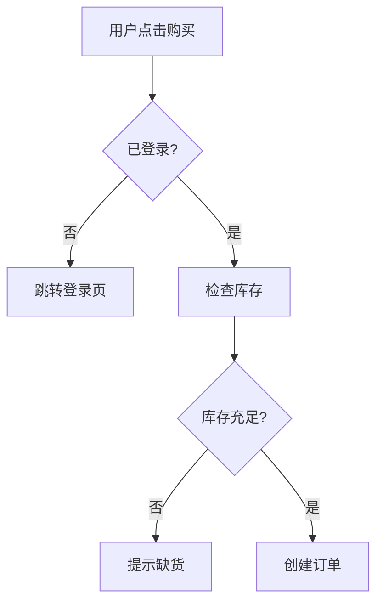

# AI 辅助开发心智模型：从小白的三支柱到完整工作流

> 一次关于"AI 开发到底该怎么组织"的讨论记录。面向刚接触 AI 辅助开发的新手。

---

## 起点：小白的三支柱理解

一位刚入门 AI 辅助开发的用户，总结出了自己的理解框架——三根支柱：

1. **流程图 = 项目核心**：我有几个流程图，是项目的核心。我看得懂，也要让 AI 看懂。按流程图开发、改 bug、增删功能。
2. **Skill = AI 能力扩展**：培养好的 skill，辅助开发。
3. **记忆文件夹 = 项目上下文**：记录设计规范、开发进度、修复记录等需要记住的东西。

这个理解对不对？

---

## 反馈：方向对，有四个地方可以补强

### 1. 流程图的格式很关键

AI 读图片流程图效果很差——它只能"猜"图片里画的什么。最好用**文本格式**的流程图，比如 Mermaid 语法写在 markdown 里：



这样 AI 能精确理解每个分支、每个状态，而不是靠视觉猜测。

### 2. CLAUDE.md 不只是"记忆文件夹"，它是指挥中心

"记录设计规范、进度"是对的，但 CLAUDE.md 的角色更重——它是**每次对话 AI 第一个读的东西**。应该放：

- 项目架构的关键决策（为什么这样设计）
- AI 容易犯错的地方（"不要动这个文件"）
- 开发规范（命名、目录结构）

单纯的进度追踪反而不太适合放这里，那个更适合用 git commit 和 issue 来管。

### 3. 缺一个"验证环"

原来的模型是：流程图 → AI 写代码。但少了一步——**怎么确认 AI 写对了？**

完整的循环应该是：

```
流程图(设计) → AI 写代码 → 验证(测试/review) → 反馈回 AI
```

验证手段可以是：跑测试、用 code-review skill 审查、自己看关键逻辑。

### 4. 小白阶段最重要的一件事

不是学更多工具，而是：**学会看 AI 写的代码，判断对不对**。

哪怕只能看懂 60%，也比完全信任 AI 强得多。流程图帮你理解"应该做什么"，你要能对照代码确认"确实做了这个"。

---

## 修正后的模型

| 支柱 | 原来的理解 | 修正后 |
|------|-----------|--------|
| 流程图 | 项目核心，AI 照着做 | 用 **Mermaid 文本格式**，不用图片 |
| Skill | 培养好的 skill 辅助开发 | 正确，无需修正 |
| 记忆文件夹 | 记录设计规范、进度 | 升级为 **CLAUDE.md 指挥中心**，进度用 git 管 |
| （缺失） | — | 补上**验证环**：测试 + review + 对照流程图 |

---

## 完整工作流一句话总结

> **流程图是"做什么"，CLAUDE.md 是"怎么做"，rules 是"做成什么样"，skill 是"AI 用什么姿势做"。**

四件套齐了，AI 就能在你的框架内干活，而不是自由发挥。

完整的框架模板见 [ai-dev-framework.md](./ai-dev-framework.md)。
